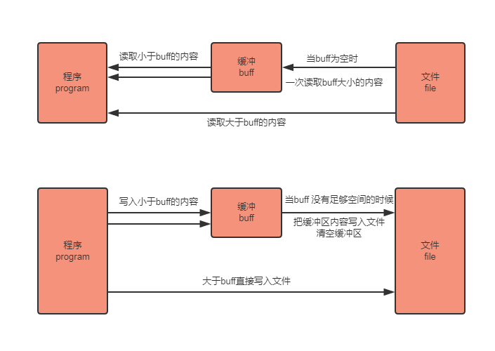

golang标准库-bufio
----
在io/bufio这个包里面有三个重要的结构体Reader,Write,Scanner，既然io包里面已经有了Reader,Writer,Scanner在这里为什么要再次出现。  
通过官方包的介绍，我们能了解到的信息如下：
bufio 是通过缓冲来提高效率.对于写入来说，它在临时存储数据之前进行的（如磁盘或套接字）。数据被存储直到达到特定大小。通过这种方式触发的写操作更少，每个操作都为系统调用，这经常完成可能会很昂贵。 对于读取而言，这意味着在单次操作中检索更多数据。它还减少了 sycall（系统调用）的数量，但还可以使用更高效的方式使用底层硬件，如读取磁盘块中的数据。

bufio 包实现原理  


bufio源码分析
1. Reader对象
	```
	type Reader struct {
        buf          []byte        // 缓存
        rd           io.Reader    // 底层的io.Reader
        // r:从buf中读走的字节（偏移）；w:buf中填充内容的偏移；
        // w - r 是buf中可被读的长度（缓存数据的大小），也是Buffered()方法的返回值
        r, w         int
        err          error        // 读过程中遇到的错误
        lastByte     int        // 最后一次读到的字节（ReadByte/UnreadByte)
        lastRuneSize int        // 最后一次读到的Rune的大小(ReadRune/UnreadRune)
    }
	```
	
2. bufio.Read(p []byte) 相当于读取大小len(p)的内容，思路如下：
   1. 当缓存区有内容的时，将缓存区内容全部填入p并清空缓存区
   2. 当缓存区没有内容的时候且len(p)>len(buf),即要读取的内容比缓存区还要大，直接去文件读取即可
   3. 当缓存区没有内容的时候且len(p)<len(buf),即要读取的内容比缓存区小，缓存区从文件读取内容充满缓存区，并将p填满（此时缓存区有剩余内容）
   4. 以后再次读取时缓存区有内容，将缓存区内容全部填入p并清空缓存区（此时和情况1一样
   
	```
	// Read reads data into p.
    // It returns the number of bytes read into p.
    // The bytes are taken from at most one Read on the underlying Reader,
    // hence n may be less than len(p).
    // At EOF, the count will be zero and err will be io.EOF.
    func (b *Reader) Read(p []byte) (n int, err error) {
        n = len(p)
        if n == 0 {
            return 0, b.readErr()
        }
        if b.r == b.w {
            if b.err != nil {
                return 0, b.readErr()
            }
            if len(p) >= len(b.buf) {
                // Large read, empty buffer.
                // Read directly into p to avoid copy.
                n, b.err = b.rd.Read(p)
                if n < 0 {
                    panic(errNegativeRead)
                }
                if n > 0 {
                    b.lastByte = int(p[n-1])
                    b.lastRuneSize = -1
                }
                return n, b.readErr()
            }
            // One read.
            // Do not use b.fill, which will loop.
            b.r = 0
            b.w = 0
            n, b.err = b.rd.Read(b.buf)
            if n < 0 {
                panic(errNegativeRead)
            }
            if n == 0 {
                return 0, b.readErr()
            }
            b.w += n
        }
    
        // copy as much as we can
        n = copy(p, b.buf[b.r:b.w])
        b.r += n
        b.lastByte = int(b.buf[b.r-1])
        b.lastRuneSize = -1
        return n, nil
    }
	```	
	
3. Writer对象
	```
	type Writer struct {
        err error        // 写过程中遇到的错误
        buf []byte        // 缓存
        n   int            // 当前缓存中的字节数
        wr  io.Writer    // 底层的 io.Writer 对象
    }

	```	
4. bufio.Write(p []byte) 的思路如下
   1. 判断buf中可用容量是否可以放下 p
   2. 如果能放下，直接把p拼接到buf后面，即把内容放到缓冲区
   3. 如果缓冲区的可用容量不足以放下，且此时缓冲区是空的，直接把p写入文件即可
   4. 如果缓冲区的可用容量不足以放下，且此时缓冲区有内容，则用p把缓冲区填满，把缓冲区所有内容写入文件，并清空缓冲区
   5. 判断p的剩余内容大小能否放到缓冲区，如果能放下（此时和步骤1情况一样）则把内容放到缓冲区
   6. 如果p的剩余内容依旧大于缓冲区，（注意此时缓冲区是空的，情况和步骤2一样）则把p的剩余内容直接写入文件
   7. 
   ```
   // Write writes the contents of p into the buffer.
   // It returns the number of bytes written.
   // If nn < len(p), it also returns an error explaining
   // why the write is short.
   func (b *Writer) Write(p []byte) (nn int, err error) {
       for len(p) > b.Available() && b.err == nil {
           var n int
           if b.Buffered() == 0 {
               // Large write, empty buffer.
               // Write directly from p to avoid copy.
               n, b.err = b.wr.Write(p)
           } else {
               n = copy(b.buf[b.n:], p)
               b.n += n
               b.flush()
           }
           nn += n
           p = p[n:]
       }
       if b.err != nil {
           return nn, b.err
       }
       n := copy(b.buf[b.n:], p)
       b.n += n
       nn += n
       return nn, nil
   }
	```  
	8. b.flush() 会将缓存区内容写入文件，当所有写入完成后，因为缓存区会存储内容，所以需要手动flush()到文件	
	
5. Scanner对象，对于Scanner对象的出现官方的说法如下  
	1. 官方描述
		```  
		在 bufio 包中有多种方式获取文本输入，ReadBytes、ReadString 和独特的 ReadLine，
		对于简单的目的这些都有些过于复杂了。在 Go 1.1 中，添加了一个新类型，Scanner，
		以便更容易的处理如按行读取输入序列或空格分隔单词等，这类简单的任务。它终结了如输入一个很长的
		有问题的行这样的输入错误，并且提供了简单的默认行为：基于行的输入，每行都剔除分隔标识。
		```	  
	
	2.  Scanner 的结构定义如下：
		```
		type Scanner struct {
			r            io.Reader // The reader provided by the client.
			split        SplitFunc // The function to split the tokens.
			maxTokenSize int       // Maximum size of a token; modified by tests.
			token        []byte    // Last token returned by split.
			buf          []byte    // Buffer used as argument to split.
			start        int       // First non-processed byte in buf.
			end          int       // End of data in buf.
			err          error     // Sticky error.
		}
		```
		
		
参考文章：
1. [深入介绍 Golang 中的 bufio.Scanner](https://juejin.im/entry/5b17971f5188257d7270967e)
2. [Golang学习 - bufio 包](https://www.cnblogs.com/golove/p/3282667.html)
3. [1. 1.4 bufio — 缓存IO](https://books.studygolang.com/The-Golang-Standard-Library-by-Example/chapter01/01.4.html)
		