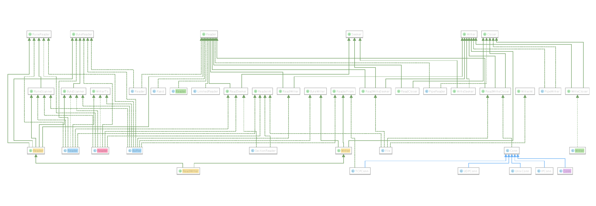

golang标准库学习--io
----

1. 博客
    1. Go语言中的io.Reader和io.Writer以及它们的实现 https://colobu.com/2016/08/29/go-io-Reader-and-io-Writer/
    2. Golang学习 - io 包  https://www.cnblogs.com/golove/p/3276678.html
    3. Go语言实战笔记（十九）| Go Writer 和 Reader   https://www.flysnow.org/2017/05/08/go-in-action-go-reader-writer.html
2. 电子书
    1. https://books.studygolang.com/The-Golang-Standard-Library-by-Example
3. 图片

学习go的io库的时候一直没有头绪，因为里面定义的接口是在太多了，仅仅最小粒度的就有Reader,Writer,Closer,Seeker,ReadFrom,WriteTo,ReadAt,WriteAt8个，除此之外还有一些组合的接口，另外还定义了一些数据接口，看的我是一头雾水。只到我看到下面一个自定义类型的Reader接口实现之后才有了转机
```
// 定义一个 Ustr 类型
type Ustr struct {
	s string // 数据流
	i int    // 读写位置
}

// 根据字符串创建 Ustr 对象
func NewUstr(s string) *Ustr {
	return &Ustr{s, 0}
}

// 获取未读取部分的数据长度
func (s *Ustr) Len() int {
	return len(s.s) - s.i
}

// 实现 Ustr 类型的 Read 方法
func (s *Ustr) Read(p []byte) (n int, err error) {
	for ; s.i < len(s.s) && n < len(p); s.i++ {
		c := s.s[s.i]
		// 将小写字母转换为大写字母，然后写入 p 中
		if 'a' <= c && c <= 'z' {
			p[n] = c + 'A' - 'a'
		} else {
			p[n] = c
		}
		n++
	}
	// 根据读取的字节数设置返回值
	if n == 0 {
		return n, io.EOF
	}
	return n, nil
}

------------------------------

　　接下来，我们就可以用 ReadFull 方法读取 Ustr 对象的数据了：

------------------------------

func main() {
	s := NewUstr("Hello World!") // 创建 Ustr 对象 s
	buf := make([]byte, s.Len()) // 创建缓冲区 buf

	n, err := io.ReadFull(s, buf) // 将 s 中的数据读取到 buf 中

	fmt.Printf("%s\n", buf) // HELLO WORLD!
	fmt.Println(n, err)     // 12 <nil>
}
```
从这个例子我猜发现，所谓实现Reader接口就是要完成从哪里读取内容这个功能，那么对应的Writer接口就是要实现朝哪里写数据的功能，而且这儿两个接口是最基本的，其他接口对应的是一些花式的玩法。