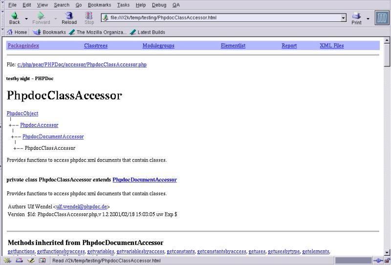

什么是phpdoc
-----
PHPDoc是PEAR下面的一个非常优秀的模块，它的目标是实现类似javadoc的功能，可以为你的代码快速生成具有相互参照,索引等功能的API文档。如果你使用过javadoc生成的文档(如jdk的文档），你会非常清楚，如果你没有用过，那么下面是一个phpdoc生成它自己的文档页面的截图：
  
从图上可以知道，phpdoc生成的文档和JAVADOC很相似，它有多种的索引方式： 
1. Packageindex:这是按照模块来索引 
2. Classtree:这是按照你的php类的继承关系，可以生成一个树状的索引 
3. Modulegroups:这是按照模块划分 
4. Elementlist:这是你的所有元素（类，方法，过程/函数，变量）的字母顺序的索引  

phpdoc的结构及功能
---
由于phpdoc本身也是符合pear的应用程序，我们首先了解一下它的结构。phpdoc是全部采用OOP的思想来编写的，这也是PEAR所推荐的方式,phpdoc的工作原理：  
phpdoc扫描指定目录下面的php源代码，扫描其中的关键字，截取需要分析的注释，然后分析注释中的专用的tag，生成xml文件，接着根据已经分析完的类和模块的信息，建立相应的索引，生成xml文件  
对于生成的xml文件，使用定制的模板输出为html文件。  
从设计上来说，phpdoc使用了2个超类：PhpdocObject和PhpdocError。这是整个PHPDOC的基本类，这种方式也是PEAR所推荐的，也就是说当你编写你自己的应用框架的时候，最好能够有一个基本的超类，而其他的子类或者是功能类都有一个共同的祖先。在扫描源代码过程中，PHPDOC使用的是类似GREP的形式，并没有象我们通常想的那样，使用正则表达式来实现，根据作者的解释，他曾经尝试过使用正则表达式，但是资源的占用和处理速度都很难令人满意，因此采用了这种非常规的形式，具体的实现有兴趣的读者可以参看源代码。我认为PHPDOC令人满意的另一方面是其分析结果是以XML形式保存的，这样就意味着其他的应用程序很容易可以共享这个数据，同时PHPDCO也提供了相应的接口，你可以实现这个接口，把API文档生成其他的形式，比如PDF，LATEX，WORD等等。目前，PHPDOC的分析结果可以以HTML形式表现，以后可能会有更多的形式。即使是HTML形式，由于使用了模板机制（他使用了PEAR的IT和ITX模块来实现），你可以很方便地定制成你自己需要的风格，

PHPDoc基础
----
PHPDoc是从你的源代码的注释中生成文档，因此在给你的程序做注释的过程，也就是你编制文档的过程。  
从这一点上讲，PHPdoc促使你要养成良好的编程习惯，尽量使用规范，清晰文字为你的程序做注释，同时多多少少也避免了事后编制文档和文档的更新不同步的一些问题。  
编制符合PHPDoc规范的注释是非常重要的，掌握了这一点，基本上就可以利用PHPDoc为你工作了。  
注释在PHPDoc中分为文档注释和非文档注释  

3.1 文档注释 
 
文档注释实际上是一些特殊形式的多行注释，一般是放在你需要注释的特定的关键字(这些关键字是指将会被phpdoc分析的那些关键字，相关的关键字列表请参看后面第4节的说明）前面。下面是一个文档注释的例子：    
```
/**
 * Common base class of all phpdoc classes （简述，用在索引列表中）
 *
 * As a kind of common base class PhpdocObject holds
 * configuration values (e.g. error handling) and debugging
 * methods (e.g. introspection()). It does not have a constructor,
 * so you can always inheritig Phpdoc classes from this
 * class without any trouble. （详细的功能描述）
 *
 * @author   Ulf Wendel 
 * @version  $Id: PhpdocObject.php,v 1.3 2001/02/18 15:29:29 uw Exp $
 * @package  PHPDoc （文档标记）
 */
class PhpdocObject {
	.....
}
```  
以上的文档注释将会生成如下的文档： 
```
<b>PhpdocObject</b>
PhpdocObject
Common base class of all phpdoc classes
<b>private class PhpdocObject </b>
Common base class of all phpdoc classes
As a kind of common base class PhpdocObject holdsconfiguration values (e.g. error
handling) and debuggingmethods (e.g. introspection()). It does not have a
constructor,so you can always inheritig Phpdoc classes from thisclass without any trouble.
Authors Ulf Wendel <ulf.wendel@phpdoc.de>
Version $Id: PhpdocObject.php,v 1.3 2001/02/18 15:29:29 uw Exp $
```
3.2 非文档性注释

如果你的注释没有放在那些phpdoc指定的关键字前面，那么phpdoc认为你所作的这些注释是属于非文档注释，将不会被phpdoc所分析，也不会出现在你产生的api文当中。  

3.3 如何书写你的文档性注释

从3.1 我们可以看到，一个文档性的注释，是由3个部分组成的，分别是：功能简述区，功能详细说明区，文档标记区。  

首先，第一行是一个注释开始的标志"/**"，然后是回车，从第2行开始就是功能简述区，功能简述区是以缩进的"*"开始的，在简述的正文和这个"*"号之间用空格分隔（注意，在文档中，都是以*开始，并且这些*保持对齐的缩进格式）。功能简述的正文一般是简明扼要地说明这个类，方法或者函数的功能，功能简述的正文在生成的文档中将显示在索引区。
  
在功能简述区后面是一个空的注释行，用来分割简述区和详细说明区。功能详细说明区也是以缩进的'*"来引导的，这部分主要是详细说明你的API的功能，用途，如果可能，也可以有用法举例等等。在这部分，你应该着重阐明你的API函数或者方法的通常的用途，用法，并且指明是否是跨平台的（如果涉及到），对于和平台相关的信息，你要和那些通用的信息区别对待，通常的做法是另起一行，然后写出在某个特定平台上的注意事项或者是特别的信息，这些信息应该足够，以便你的读者能够编写相应的测试信息，比如边界条件，参数范围，断点等等。
  
在功能详细说明区后面，是空白的注释行，然后是文档标记区，你可以在这些书写相关的文档标记（这些文档标记的用法请参考后面的第4节），指明一些技术上的细节信息，最主要的是调用参数类型，返回值极其类型，继承关系，相关方法/函数等等。多个文档标记应该使用相同的缩进，组成一个"标记块"，便于阅读和分析。
  
在文档标记区下面的一行就是注释结束行"*/",注意，在注释结束标记*/后面应该直接跟一个回车，不要另外附加其他的东西，否则可能造成PHPDOC分析出错。
  
以上就是书写一个文档性注释的基本方法，下面我们讨论一下书写文档时的规范和技巧。  

3.4 文档书写指南

在你描述你的代码的用途或者是功能的时候，最好能够遵循大多数人的习惯，通俗地讲就是"你告诉我的信息正是我想要知道的"。为此，这里将介绍一些书写文档注释的技巧和规范，希望能够对你有所帮助：
  
1. 使用\<code>来标志关键字和命名及相关的代码。如果在文档中需要引用一些关键字，变量名，或者是你要给出一些代码的例子，那么你最好使用\<code>\</code>来将这些关键字，变量名，代码片段和你的文档分隔开，这样，读者阅读的时候，将会知道，这些将是运行的代码，关键字而不是你的描述性的语言。  
2. 使用简单，明确的语言，避免冗长，复杂，晦涩的长句来描述。尤其是在功能简述，参数说明等索引部分中，尽量使用简单明白的语言揭示主要的信息，把其他的细节放在详细说明部分去阐述。如果你使用英语，建议使用短语而不一定是句子。  
3. 如果使用英语，建议使用第3人称单数的形式来说明  
4. 在给方法，函数说明的时候，你需要说明的是这个方法"作了什么"，而不是"怎么做"。因此，建议你的说明是以动词开始，比如"返回记录数"，"删除给定的记录"等等。  
5. 当你引用的某个对象或者变量是从当前的类中建立的，那么使用 "this" 代替 "the" 来指代那个对象或者是变量  
6. 避免空话，废话，对于你所要给出的API，在你的API后面要有它的功能描述，是其能够"自成文档"。所谓的空话，废话是指，你的描述不是功能描述，而只是API名称的简单重复和罗列，或者是用另一个API来解释这个API，到头来，你的读者也不知道你所要表达的内容实质。你的描述，应该是那些从你的类名，方法名，或者是函数名看不到的补充的信息，而不是把你的API名称再重复一遍。很多人可能很多人（包括我）不知不觉中就犯了这个错误，下面是一个例子：  
```
/**
 * 设置用户记录集
 *
 * @param text  给定的表名
 */
function set_user_record($table) {
```
你从上面这段注释中能够知道什么？因此，这段注释实际上是废话，因为你从函数名称上是可以看出的，下面是改进后的：  
```
/**
     * 打开系统用户表并设置为当前用户记录集，此记录集将用于随后相关用户数据更新操作的缺省记录集。
如果失败则抛出一个数据库错误。
     *
     * @param text  要打开的系统用户表的表名。
     */
    function set_user_record($table) {
```
适当地使用链接。为你文档中引用的API名称（包括你的其他类及方法，PHP的函数等）添加适当的链接是很受欢迎的：你可以使用@link标记来添加到相关的API的链接，不过，你没有必要为文档中引用的所有的API都添加连接，这样会很不美观，这里有一个简单的标准：如果用户在这个地方看到某个API，确实希望要去点击以便获取更多信息，这样有助于他们去理解你的文档，并且即使添加了链接，只在它第一出现的是时候添加，没有必要重复添加相同的LINK。  
由于PHPDOC的功能限制，一个PHP文件只定义一个类或模块，不要把类和模块的定义放在同一个文件里，否则PHPDOC可能无法工作，至少目前版本是这样。如果你的框架使用OOP来构建，应避免同时使用模块或模块组；同时应该仔细规划你的应用结构，你的应用框架应该是一个类似树型的结构，顶层的分支不要太多，例如你可以设计2个超类，分别是作为正常应用和错误处理的超类，其余的都从这2个类派生出来。  

PHPDoc关键字及文档标志
---
4.1 关键字  
class 、function 、var 、include (include_once, require, require_once) 、define
在以上这些关键字前面所做的注释，都被认为是文档性注释。

4.2 文档标记  
说明：使用范围是指该标记可以用来修饰的关键字，或其他文档标记   

@abstract 使用范围：class, function, var   
说明当前类是一个抽象类。  

注释：从PHP语言角度来说，它并不象JAVA，C++那样，支持抽象类这个概念。也没有相应的关键字来修饰某个类是抽象类。由于PHPDOC实际上大部分是借鉴了JAVADOC的做法，因此很多文档标记也是直接从JAVADOC中沿袭过来，如abstract,access,final等等。虽然这些特性没有从语言级别得到支持，不过从使用者角度来遵循这些特性，仍是值得推荐的。  
举例：  
```
/**
* 这是一个绘五星图案的抽象类.
* @abstract
*/
class paint_start {
  /**
  * 绘制数量
  * @abstract
  */
  var $number;
  /**
  * 绘制五星图案
  * @abstract
  */
  function paint() {
    ;
  }
}
```
@access (public|private) 使用范围：class, function, var, define, module  
指明这个变量、类、函数/方法的存取权限。如果你的函数是内部使用，你应该指明它为private,这样的好处是，即使PHP不能阻止其他的人使用你的私有数据，但是至少你向你的用户传达这样的信息，这是一个私有的函数，因此不保证在将来的版本中仍存在；对于使用者而言，表示为@private的数据和方法，你不应该直接使用，即使你可以这样做。
  
举例：  
```
/**
* 这是一个绘五星图案的抽象类.
* @abstract
* @access    public
*/
class paint_start {
   
  /**
  * 绘制数量
  * @abstract
  * @access    private
  */
  var $number;
     
  /**
  * 绘制五星图案
  * @abstract
  * @access    public
  */
  function paint() {
    ;
  }
     
}
```
@author Name [<email>] [, ...] 使用范围：class, function, var, define, module, use  
指明作者信息,依次是作者姓名，email地址，其他的通讯信息。如果有多个作者，按照其先后次序，使用多个@author依次列出：
  
1. @author Night Sailer <night@hotmail.com>  
2. @author Lee Tester <tester@gnome.org>  

@brother (function()|$variable) 使用范围：class, function, var, define, module, use   
@sister (function()|$variable) 使用范围：class, function, var, define, module, use  
指出兄弟类、函数或者是变量.这些函数、类、变量等有相似的信息和并实现相同的功能。比如，调用和返回的参数的个数和类型相同，实现的功能也一样。这种情况，你可以使用@brother 或者 @sister指明它的兄弟函数，无须在重复书写函数的功能等信息了。  
举例：  
```
/**
* 这是一个绘五星图案的抽象类.
* @abstract
* @access    public
*/
class paint_start {
   
  /**
  * 绘制数量
  * @abstract
  * @access    private
  */
  var $number;
     
  /**
  * 绘制五星图案
  * @abstract
  * @access    public
  */
  function paint() {
    ;
  }
  /**
  * @brother paint() 
  */
  function draw() {
    ;
  }
     
}
```
@const[ant] label [description] 使用范围：define  
指明常量   
这个标记实际上是用来说明php的define关键字定义的常量。  

@copyright description 使用范围：class, function, var, module, define, use   
指明版权信息。  

@deprec[ated] label 使用范围：class, function, var, module, define, use   
指明不推荐或者是废弃的信息.  

如果你的某个函数或者方法，已经被新的函数方法替代，或者是已经废弃，不希望读者继续使用。那么你可以使用这个标志告诉读者，这个函数只是为了保持兼容性而保留的，它不被推荐使用，如果它已经被其他函数替代，也要指出这个替代者。  
例子： 
```
/**
* 过时的类
*
* @deprec  1.5-2000/12/06
* @access  public
*/
function dontUseMeAnyMore() {
  print "Don't use me any more. I have been deprecated.";
}
```
@exclude label 使用范围：class, function, var, module, define, use   
指明当前的注释将不进行分析，不出现在文挡中  

@final 使用范围：class, function, var   
指明这是一个最终的类、方法、属性，禁止派生、修改。   

举例：
```
/**
* 圆周率  
* @final
*/
var $PI = 3.1415926;
```
@global (object objecttype|type) [$varname] [description] 使用范围：function   
指明在此函数中引用的全局变量   

举例：  
```
/**
* Simuliert include_once in PHP 3.
*
* @global  array   $__used_files   已经include的文件列表
* @access  public
*/
function include_once($filename) {
  global $__used_files;
     
  if (!isset($__used_files["include_once"][$filename])) {
    $__used_files["include_once"][$filename] = true;
    include($filename);
  }
}
```
@include description 使用范围：use    
指明包含的文件的信息。   

举例：  
```
/**
* 抽象绘图类的定义.
*
* @include  Function: _require_
*/
require("abstract.php");
```
@link URL description 使用范围：class, function, var, module, define, use   
定义在线连接，如上面3.4中讲到的，你可以使用@link添加适当的在线链接。   

例如：@link http://www.phpdoc.de/ PHPDoc Home  

@magic description   
这个标记在phpdoc中没有说明，具体用法现在仍不清楚  

@module label 使用范围：module   
定义归属的模块信息，label是模块的名字，拥有相同的模块名字的函数在索引分类中将被组合在一起。如果你没有使用OOP的思想来编写PEAR代码，那么建议你使用这个标记把相关的函数归集到相应的模块下面，这样你的整体的框架不至于过于零散和混乱。  

@modulegroup label 使用范围：module   
定义归属的模块组 label是这个模块组的名字，如果你的应用程序的模块很多，你可以把不同的模块按照逻辑功能的不同，划分成相应的模块组，这样，你的应用框架可以有比较清晰的逻辑关系。这是对于没有使用OOP编程的来说的，如果使用OOP的思想，没有必要使用模块组的概念，因为直接使用"包-超类--基类--子类"的形式来体现你的框架结构要比使用"包-模块组-模块"的形式好的多。  

@package label 使用范围：class, module   
定义归属的包的信息,label 是这个包的名字。相同的包的名字的类在最终文档索引中将被分在一起。实际上，包还可以理解为不同的名字空间，虽然PHP没有名字空间的概念，但是你可以把相关的类、模块都归属于同一个包，这样，相当于组织了一个名字空间，当然，你的应用框架可能会有不同的包，可惜的是，这种情况下从语法上是得不到名字空间这种保证的，你只能通过人为地去避免不同的包的函数或者类重名。  

@param[eter] (object objecttype|type) [$varname] [description] 使用范围：function   
定义函数或者方法的参数信息。这是最常使用的文档标记了。  

ojecttype 是对象的类名，type 指出这个参数的类型，它可以是下列类型：  
string 该参数是一个字符型变量。  
array 该参数是一个数组。  
integer 该参数是一个数值型。  
integer (octal) 该参数是一个数值型，并且是按照八进制方式存放。  
integer (hexadecimal) 该参数是一个数值型，并且是按照十六进制方式存放。  
boolean 该参数是一个布尔型。  
mixed 该参数的类型是可变的，可以上面几种类型的组合。不过，在随后的说明中一般要说明可以接受的变量的类型。  
$varname 是形参的名称   
[description] 是对于参数的说明。   
如果函数接受的是多个参数，那么要按照从左到右，依次用@param对齐列出，如下面所示：
```  
/*
*
* @param    array    $tags      array of tags returned by getTags
* @param    array    $data      array where the allowed tags and their values are
                                             copied to
* @param    array    $allowed   array of allowed (recognized) tags
*/ 
```
@return (object objecttype|type) [$varname] 使用范围：function  
定义函数或者方法的返回信息。   

返回信息的类型同@param一样，$varname是返回变量的名称，可有可无。不同的是@return只有一个，不会出现多个@return  

@see (function()|$varname|((module|class)::)(function()|$varname)) [, ...] 使用范围：class, function, var, module, define, use   
定义需要参考的函数、变量，并加入相应的超级连接。这也是较常用的标记。对于相关的函数，变量，你可以使用@see来增加一个到相关函数和变量的链接。多个相关的函数、变量写在一行，中间用逗号来分隔。   
参考的函数、变量如果是当前类或模块的，那么你可以直接写函数、或者变量的名，如果是函数那么要在函数名后面加上括号（），变量名要加上$。需要注意的，这里所谓的变量名也应该是你用@var来说明过的，否则，phpdoc将无法找到相关的参照而报错。   
如果你想引用其他类或者其他模块的函数或者是变量，那么，你可以在函数名、变量名前面加上类或模块的名字作为范围指示，中间用：：来分隔。
  
下面是一些例子：   
@see $run_time,$idle_time,$begin_time,$end_time   
@see getRuntime(), getIdletime(),getBegintime(),getEndtime()   
@see TIME::$run_time, TIME::getBegintime()
  
@since label 使用范围： class, function, var, module, define, use   
指明该api函数或者方法是从哪个版本开始引入的。  
  
@static 使用范围：class, function, var 
指明变量、类、函数是静态的。  

@throws exception [, exception] 使用范围： function 
指明此函数可能抛出的错误异常,极其发生的情况 
如果你预料到在这个函数中有产生异常的条件，那么你可以使用@throws标记来说明这些异常是什么，什么情况下产生异常。比如，读取磁盘文件出错，无法连接数据库，网络连接超时或者是在一些情况下，你"故意"抛出的异常等等。 

@todo 使用范围：class, function, module, use   
指明应该改进或没有实现的地方  

@var[iable] (object objecttype|type) [$varname] [description] 使用范围：var   
定义说明变量/属性。 

object objecttype|type 定义你的变量的类型，同@param一样   
$varname 该变量的名字，你可以从其他地方使用@see来引用这个名字   
description 对变量的描述  

@version label 使用范围：class, function, module, use   
定义版本信息.  

你当然可以自己手工写这些版本信息，不过PEAR推荐你使用CVS的$Id标记来自动标示你的版本信息。形式如下：  
@version $Id  
这样，当你checkout的时候，CVS自动会扩展成： @version $Id: PhpdocParserCore.php,v 1.4 2001/02/18 14:45:27 uw Exp  

生成文档
----
5.1 安装PHPDOC  
安装PHPDOC很简单,实际上因为它已经随同PHP 4.05一同发布了,所以如果你的PHP是4.05,那么在PEAR目录下面会发现PHPDOC这个模块.如果你没有发现,你可以从PHPDOC的CVS获得一份最新的源码.

5.2 运行PHPDOC  
运行PHPDOC需要做一些准备工作,首先要调整你的PHP.INI的参数，
因为PHPDOC运行的时间比一般的PHP应用要长，很可能会超过你在PHP.INI中定义的最大运行时间（缺省是30秒），根据作者的建议：PIII，60秒，120秒PII，240秒MMX200，480秒如果配置更低的话。如果出现超时，你可以自己适当延长这些数值。
在php.ini中修改：
```
;;;;;;;;;;;;;;;;;;;
; Resource Limits ;
;;;;;;;;;;;;;;;;;;;
max_execution_time = 480    
memory_limit = 8388608
```
如果你不愿意或者没有修改php.ini的权限，那么你可以使用set_time_limit（）函数来设置这个时间，使用方法： set_time_limit(480); 设置从此点开始，运行480秒后才超时。将这个函数加在index.php中，就可以和修改php.ini达到同样的效果。
其次，你要修改phpdoc目录下面的index.php文件：
```
// Directory with include files
define("PHPDOC_INCLUDE_DIR", "c:/www/apache/doc/");
```
将"c:/www/apache/doc/修改成你的phpdoc的目录   
// Important: set this to the Linebreak sign of your system!   
define("LINEBREAK", "\r\n");   
这是定义换行的标志，DOS下面是换行+回车，UNIX下面只是回车就可以。  
下面，为你的要生成文档的应用程序做一些定制工作：  
```
// Sets the name of your application.
// The name of the application is used e.g. as a page title
$doc->setApplication("PHPDoc");
setApplication（）用来设置你的应用程序的名称，将PHPDOC替换成你应用程序的名字。
// directory where your source files reside:
$doc->setSourceDirectory(PHPDOC_INCLUDE_DIR);
setSourceDirectory（）
设置你的应用程序的PHP源文件所在的目录，将PHPDOC_INCLUDE_DIR替换成你实际的目录。
// save the generated docs here:
$doc->setTarget(PHPDOC_INCLUDE_DIR."apidoc/");
setTarget（）
设置你的API文档存放的目录，PHPDOC将在这个目录下面生成XML及HTML文件。
将PHPDOC_INCLUDE_DIR."apidoc/"替换成你自己的目录。
// use these templates:
$doc->setTemplateDirectory(PHPDOC_INCLUDE_DIR."renderer/html/templates/");
setTemplateDirectory（）设置HTML所使用的模板的目录。如果你需要使用定制的模板，
可以使用这个函数设置你自己的模板文件所在的目录。
// source files have one of these suffixes:
$doc->setSourceFileSuffix( array ("php", "inc") );
setSourceFileSuffix（）用来设置需要分析的PHP源文件的扩展名，如果你使用了别的扩展名，
需要在这里添加，比如如果你有以前的php3文件，需要添加：
$doc->setSourceFileSuffix( array ("php", "inc"，"php3") );
```
这样，基本的定制工作就完成了，现在你可以在浏览器中运行index.php,出现了欢迎信息后,就是开始分析文档了.根据机器的状况和所分析的源代码文件的数量不同,文档分析过程所需的时间也不会相同.文档分析结束后,浏览器会显示FINISH的字样,表明分析完成,你可以在刚才指定的目录下面找到分析结果,包括HTML和XML文件.
  
5.3 实用工具    

通过PHPDOC的INDEX.PHP虽然可以产生文档,但是毕竟不是那么方便,这里我给出了一个自己写的shell程序 makeapidoc,你可以用它来方便的产生你的API文档,无须每次都要修改，也不用非要启动浏览器来执行。  
用法如下: makeapidoc -t 你的应用程序的标题 -s 源程序目录 -d 生成文档存放目录  
在使用之前，先修改下面2行：  
PHPDOC_DIR="/usr/local/lib/php/pear/PHPDoc" # windows: c:/php/pear/PHPDoc   
PHPBIN="/usr/local/bin/php" #windows: c:/php/php.exe  
PHPDOC_DIR是PHPDOC的目录，PHPBIN是PHP可执行文件的路径。  
这个程序实际上是把PHP作为一个SHELLSCRIPT来使用了，不过是嵌在BASH中使用，实际上PHP完全可以做为普通的SHELL脚本一样运行，只需加上 -q 参数，这样就不打印HTTP HEADER了。  
进阶：定制输出的文档  
如果你认为缺省的PHPDOC产生的HTML文档不够美观,你想做进一步的改进,比如你想把一些注释换成中文或者是其他的文字,你想加入你的LOGO,或者是你的联系方式,换成一个漂亮的背景图案,有没有方法可以作到?答案是当然可以,并且非常简单.  
PHPDOC在输出HTML格式的API文档的时候,使用的是PEAR的IT,ITX模块,这是类似PHPLIB的TEMPLETE.CLASS的PEAR模块,因此,你可以方便地定制和修改缺省的模板来为你所用.  
我们先看看PHPDOC/renderer/html/templates: class.html classtree.html elementlist.html frame_packageelementlist.html frame_packagelist.html module.html modulegroup.html packagelist.html phpdoc.css warnings.html xmlfiles.html  
你会看到上面的这些文件,没错,这些就是PHPDOC用来产生API HTML的模板,现在你可以用你的编辑器来修改这些模板了,这里给出基本的修改原则:  
对于用{}圈起来的标记,这些是一些变量的标记,在运行时刻,PHPDOC将会用实际的变量值替换到相应的位置.因此,你务必要保留全部的变量标记,否则运行时将会出错.  
你要注意<!--Begin Xxx-loop --><!--End Xxx -loop-->之类带LOOP的注释,在这2个标记中间的部分,将会用于循环输出,所以,你在设计模板时要考虑到循环使用,是否会破坏你页面的美观,最简单的比如:如果循环的部分是在一个表格内,你要用<tr>用来分隔各循环调用的部分,同时应该保证各个<TD></TD>是匹配关闭的.  
当你修改的地方不大,你也可以直接修改样式表phpdoc.css的内容,这样也可以达到你要求的效果  
你可以把模板存放在不同的目录，通过setTemplateDirectory（）设置不同的模板路径，就可以生成不同格式的API文档  